# Diagrama de Arquitectura POC3 Security

## Diagrama Mermaid (para importar a Draw.io)

```mermaid
graph TB
    %% Clientes y Herramientas de Testing
    subgraph "Clientes y Testing"
        PM[Postman<br/>Colecciones de Pruebas]
        K6[K6<br/>Pruebas de Carga]
        CLI[Cliente HTTP<br/>curl/requests]
    end

    %% API Gateway y Autenticación
    subgraph "POC3 Security API"
        API[FastAPI Server<br/>Puerto 8083]
        AUTH[JWT Authentication<br/>auth.py]
        CRYPTO[Encryption Service<br/>crypto.py]
        MIDDLEWARE[Metrics Middleware<br/>Observabilidad]
    end

    %% Endpoints de Autenticación
    subgraph "Endpoints de Autenticación"
        LOGIN[POST /auth/login<br/>Autenticación de usuarios]
        REFRESH[POST /auth/refresh<br/>Renovación de tokens]
        ME[GET /auth/me<br/>Info del usuario actual]
        DEMO[GET /auth/demo-tokens<br/>Tokens de demostración]
        TOKEN_INFO[GET /auth/token-info<br/>Debug de tokens]
    end

    %% Endpoints de Clientes
    subgraph "Endpoints de Clientes"
        CREATE[POST /customers<br/>Crear cliente]
        GET[GET /customers/{email}<br/>Obtener cliente]
        LIST[GET /customers<br/>Listar clientes]
        DELETE[DELETE /customers/{email}<br/>Eliminar cliente]
        LEGACY[POST/GET /customers-legacy<br/>Compatibilidad]
    end

    %% Sistema de Seguridad
    subgraph "Sistema de Seguridad"
        JWT_VALIDATOR[JWT Validator<br/>Verificación de tokens]
        ROLE_MANAGER[Role Manager<br/>Control de acceso]
        MFA_CHECKER[MFA Checker<br/>Verificación MFA]
        ENCRYPTION[Fernet Encryption<br/>AES-128 + HMAC]
    end

    %% Base de Datos
    subgraph "Almacenamiento"
        USER_DB[(User Database<br/>Usuarios y Roles)]
        CUSTOMER_DB[(Customer Database<br/>Datos Encriptados)]
        TOKEN_STORE[(Token Store<br/>Refresh Tokens)]
    end

    %% Observabilidad
    subgraph "Observabilidad"
        PROMETHEUS[Prometheus<br/>Métricas]
        GRAFANA[Grafana<br/>Dashboards]
        JAEGER[Jaeger<br/>Trazabilidad]
        METRICS[GET /metrics<br/>Endpoint de métricas]
    end

    %% Flujos de Conexión
    PM --> API
    K6 --> API
    CLI --> API

    API --> AUTH
    API --> CRYPTO
    API --> MIDDLEWARE

    AUTH --> LOGIN
    AUTH --> REFRESH
    AUTH --> ME
    AUTH --> DEMO
    AUTH --> TOKEN_INFO

    API --> CREATE
    API --> GET
    API --> LIST
    API --> DELETE
    API --> LEGACY

    AUTH --> JWT_VALIDATOR
    AUTH --> ROLE_MANAGER
    AUTH --> MFA_CHECKER
    CRYPTO --> ENCRYPTION

    JWT_VALIDATOR --> USER_DB
    CREATE --> CUSTOMER_DB
    GET --> CUSTOMER_DB
    LIST --> CUSTOMER_DB
    DELETE --> CUSTOMER_DB
    LEGACY --> CUSTOMER_DB

    REFRESH --> TOKEN_STORE
    AUTH --> TOKEN_STORE

    MIDDLEWARE --> PROMETHEUS
    PROMETHEUS --> GRAFANA
    API --> JAEGER
    API --> METRICS

    %% Estilos
    classDef clientStyle fill:#e1f5fe,stroke:#01579b,stroke-width:2px
    classDef apiStyle fill:#f3e5f5,stroke:#4a148c,stroke-width:2px
    classDef authStyle fill:#fff3e0,stroke:#e65100,stroke-width:2px
    classDef securityStyle fill:#ffebee,stroke:#c62828,stroke-width:2px
    classDef dataStyle fill:#e8f5e8,stroke:#2e7d32,stroke-width:2px
    classDef obsStyle fill:#f1f8e9,stroke:#558b2f,stroke-width:2px

    class PM,K6,CLI clientStyle
    class API,MIDDLEWARE apiStyle
    class AUTH,LOGIN,REFRESH,ME,DEMO,TOKEN_INFO authStyle
    class JWT_VALIDATOR,ROLE_MANAGER,MFA_CHECKER,ENCRYPTION,CRYPTO securityStyle
    class USER_DB,CUSTOMER_DB,TOKEN_STORE dataStyle
    class PROMETHEUS,GRAFANA,JAEGER,METRICS obsStyle
```

## Diagrama de Flujo de Autenticación

```mermaid
sequenceDiagram
    participant C as Cliente
    participant API as FastAPI Server
    participant AUTH as JWT Service
    participant DB as User Database
    participant CRYPTO as Encryption Service
    participant CUST_DB as Customer Database

    Note over C,CUST_DB: Flujo de Creación de Cliente

    C->>API: POST /auth/login {username, password}
    API->>AUTH: authenticate_user()
    AUTH->>DB: Verificar credenciales
    DB-->>AUTH: Usuario válido + roles
    AUTH->>AUTH: create_access_token()
    AUTH->>AUTH: create_refresh_token()
    AUTH-->>API: Tokens JWT generados
    API-->>C: {access_token, refresh_token, expires_in}

    C->>API: POST /customers + Bearer token
    API->>AUTH: verify_token()
    AUTH-->>API: Usuario autenticado + roles
    API->>CRYPTO: encrypt_field(email, phone)
    CRYPTO-->>API: Datos encriptados
    API->>CUST_DB: Guardar cliente encriptado
    CUST_DB-->>API: Cliente guardado
    API-->>C: {ok: true, message, customer_email}

    Note over C,CUST_DB: Flujo de Lectura de Cliente

    C->>API: GET /customers/{email} + Bearer token
    API->>AUTH: verify_token()
    AUTH-->>API: Usuario autenticado + MFA
    API->>CUST_DB: Buscar cliente
    CUST_DB-->>API: Datos encriptados
    API->>CRYPTO: decrypt_field(email, phone)
    CRYPTO-->>API: Datos desencriptados
    API-->>C: Cliente completo en texto plano
```



## Diagrama de Componentes de Seguridad

```mermaid
graph LR
    subgraph "JWT Authentication"
        JWT1[Access Token<br/>30 min expiración]
        JWT2[Refresh Token<br/>7 días expiración]
        JWT3[Token Validation<br/>HMAC-SHA256]
    end

    subgraph "Data Encryption"
        ENC1[Fernet Encryption<br/>AES-128 CBC]
        ENC2[HMAC Verification<br/>Integridad de datos]
        ENC3[Key Management<br/>Archivo .devkey]
    end

    subgraph "Role-Based Access"
        RBAC1[Admin Role<br/>Acceso completo]
        RBAC2[User Role<br/>Acceso limitado]
        RBAC3[Permission Check<br/>Middleware]
    end

    subgraph "MFA Integration"
        MFA1[MFA Verification<br/>En token JWT]
        MFA2[Header Validation<br/>x-mfa: true]
        MFA3[Token Requirements<br/>Obligatorio]
    end

    JWT1 --> ENC1
    JWT2 --> ENC1
    JWT3 --> RBAC1
    RBAC1 --> MFA1
    RBAC2 --> MFA2
    MFA1 --> ENC2
    MFA2 --> ENC3
```



## Instrucciones para Draw.io

1. **Abrir Draw.io**: Ve a https://app.diagrams.net/
2. **Crear nuevo diagrama**: Selecciona "Create New Diagram"
3. **Importar Mermaid**: 
   - Ve a "Arrange" > "Insert" > "Advanced" > "Mermaid"
   - Copia y pega el código Mermaid del primer diagrama
4. **Personalizar**: 
   - Ajusta colores y estilos
   - Agrega iconos específicos
   - Modifica el layout según prefieras

## Elementos Clave del POC3

### 🔐 Autenticación JWT
- **Access Tokens**: 30 minutos de expiración
- **Refresh Tokens**: 7 días de validez
- **Algoritmo**: HMAC-SHA256
- **Usuarios**: admin, user1, user2

### 🛡️ Encriptación de Datos
- **Algoritmo**: Fernet (AES-128 + HMAC)
- **Campos Encriptados**: email, phone
- **Campos Planos**: name
- **Gestión de Claves**: Archivo .devkey

### 👥 Control de Roles
- **Admin**: Acceso completo + eliminación
- **User**: Solo lectura y creación
- **MFA**: Obligatorio en todos los endpoints

### 📊 Observabilidad
- **Prometheus**: Métricas de rendimiento
- **Grafana**: Dashboards visuales
- **Jaeger**: Trazabilidad distribuida
- **Logs**: Auditoría completa

### 🧪 Testing
- **Postman**: 20+ pruebas de API
- **K6**: Pruebas de carga y rendimiento
- **Scripts**: Automatización de pruebas
