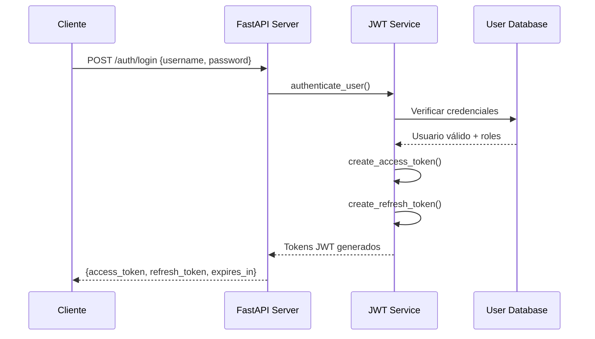
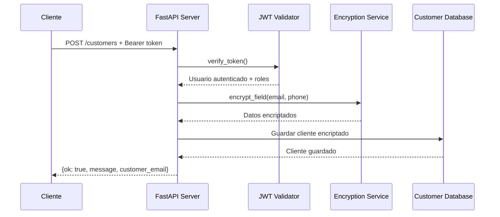
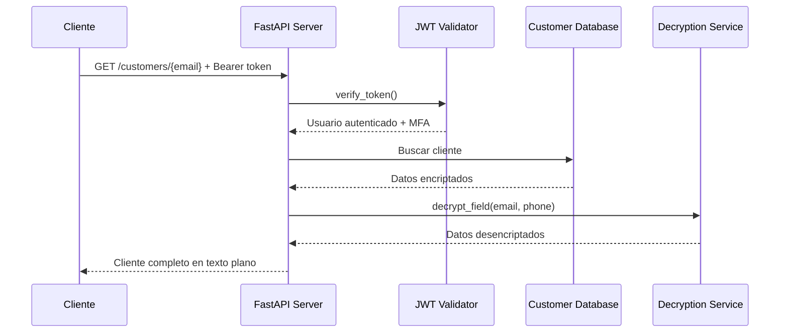

# POC 3 Security - Explicación Completa

## 📋 Tabla de Contenidos

1. [¿Qué es el POC 3?](#qué-es-el-poc-3)
2. [Arquitectura del Sistema](#arquitectura-del-sistema)
3. [Componentes Principales](#componentes-principales)
4. [Flujos de Trabajo](#flujos-de-trabajo)
5. [Características de Seguridad](#características-de-seguridad)
6. [Endpoints y API](#endpoints-y-api)
7. [Sistema de Autenticación JWT](#sistema-de-autenticación-jwt)
8. [Encriptación de Datos](#encriptación-de-datos)
9. [Suite de Pruebas](#suite-de-pruebas)
10. [Observabilidad](#observabilidad)
11. [Casos de Uso Reales](#casos-de-uso-reales)
12. [Troubleshooting](#troubleshooting)

---

## 🎯 ¿Qué es el POC 3?

El **POC 3 Security** es una demostración de un sistema de seguridad robusto que implementa las mejores prácticas en el manejo seguro de datos sensibles. Es parte de un conjunto de 4 POCs que forman el proyecto MediSupply.

### Objetivos del POC 3

- **Autenticación Multi-Factor (MFA)** obligatoria para todas las operaciones
- **Encriptación de campos sensibles** (email y teléfono) usando Fernet
- **Autenticación JWT** con access tokens y refresh tokens
- **Control de roles** (admin/user) con permisos diferenciados
- **Validación estricta** de headers de seguridad
- **Manejo seguro de datos** de clientes con auditoría completa
- **Resistencia a vulnerabilidades** comunes de seguridad

### ¿Por qué es importante?

En el contexto de MediSupply (una empresa de suministros médicos), el POC 3 demuestra cómo:

1. **Proteger datos personales** de clientes (cumplimiento GDPR/LOPD)
2. **Implementar autenticación robusta** para sistemas críticos
3. **Encriptar información sensible** en reposo
4. **Controlar el acceso** basado en roles de usuario
5. **Auditar todas las operaciones** para cumplimiento regulatorio

---

## 🏗️ Arquitectura del Sistema

### Diagrama de Alto Nivel

```
┌─────────────────┐    ┌─────────────────┐    ┌─────────────────┐
│   Cliente       │    │   FastAPI       │    │   JWT Service   │
│   (Postman/K6)  │───▶│   POC3 API      │───▶│   (auth.py)     │
│                 │    │   Puerto 8083   │    │                 │
└─────────────────┘    └─────────────────┘    └─────────────────┘
         │                       │                       │
         │                       ▼                       ▼
         │              ┌─────────────────┐    ┌─────────────────┐
         │              │   Encryption    │    │   User Database │
         │              │   Service       │    │   (Simulada)    │
         │              │   (crypto.py)   │    └─────────────────┘
         │              └─────────────────┘
         │                       │
         ▼                       ▼
┌─────────────────┐    ┌─────────────────┐
│   Access Token  │    │   Customer DB   │
│   (30 min)      │    │   (Encriptada)  │
└─────────────────┘    └─────────────────┘
```

### Componentes del Sistema

1. **API FastAPI** - Servidor web principal (puerto 8083)
2. **JWT Service** - Manejo de autenticación y tokens
3. **Encryption Service** - Encriptación/desencriptación de datos
4. **Middleware de Observabilidad** - Métricas y logging
5. **Base de Datos Simulada** - Almacenamiento en memoria
6. **Sistema de Validación** - Validación de entrada y MFA

---

## 🔧 Componentes Principales

### 1. API Principal (`poc3_security/api.py`)

```python
from fastapi import FastAPI, Depends, HTTPException, status
from pydantic import BaseModel
from common.observability import MetricsMiddleware, metrics_asgi_app
from poc3_security.crypto import encrypt_field, decrypt_field
from poc3_security.auth import (
    authenticate_user, create_access_token, create_refresh_token, 
    get_current_active_user, require_mfa_verified, require_admin_role
)

app = FastAPI(title="POC3 Security with JWT Authentication")
app.add_middleware(MetricsMiddleware)
app.mount("/metrics", metrics_asgi_app())
```

**Funcionalidades Clave:**
- **Endpoints de autenticación** JWT
- **Endpoints de clientes** protegidos
- **Middleware de métricas** para observabilidad
- **Validación de roles** y MFA

### 2. Sistema de Cifrado (`poc3_security/crypto.py`)

```python
from cryptography.fernet import Fernet
import os

KEY_FILE = os.getenv("CRYPTO_KEY_FILE", ".devkey")

def load_key():
    if not os.path.exists(KEY_FILE):
        with open(KEY_FILE, "wb") as f: 
            f.write(Fernet.generate_key())
    with open(KEY_FILE, "rb") as f: 
        return f.read()

FERNET = Fernet(load_key())

def encrypt_field(plain: str) -> str:
    return FERNET.encrypt(plain.encode()).decode()

def decrypt_field(cipher: str) -> str:
    return FERNET.decrypt(cipher.encode()).decode()
```

**Características del Cifrado:**
- **Algoritmo**: Fernet (AES 128 en modo CBC con HMAC)
- **Generación de Clave**: Automática si no existe
- **Almacenamiento**: Archivo `.devkey` local
- **Seguridad**: Clave única por instalación

### 3. Sistema de Autenticación (`poc3_security/auth.py`)

```python
import jwt
from datetime import datetime, timedelta
from typing import Optional, Dict, Any
from fastapi import HTTPException, status, Depends
from fastapi.security import HTTPBearer, HTTPAuthorizationCredentials

# Configuración de JWT
SECRET_KEY = os.getenv("JWT_SECRET_KEY", "your-secret-key-change-in-production")
ALGORITHM = "HS256"
ACCESS_TOKEN_EXPIRE_MINUTES = 30
REFRESH_TOKEN_EXPIRE_DAYS = 7
```

**Funcionalidades:**
- **Creación de tokens** JWT (access y refresh)
- **Validación de tokens** con verificación de firma
- **Gestión de usuarios** y roles
- **Control de acceso** basado en roles

---

## 🔄 Flujos de Trabajo

### 1. Flujo de Autenticación



### 2. Flujo de Creación de Cliente



### 3. Flujo de Lectura de Cliente



---

## 🛡️ Características de Seguridad

### 1. Autenticación JWT

**Access Tokens:**
- **Duración**: 30 minutos
- **Algoritmo**: HMAC-SHA256
- **Contenido**: Usuario, roles, MFA verificado
- **Uso**: Acceso a endpoints protegidos

**Refresh Tokens:**
- **Duración**: 7 días
- **Propósito**: Renovar access tokens sin re-autenticación
- **Seguridad**: Firmado digitalmente

### 2. Encriptación de Datos Sensibles

**Campos Encriptados:**
- **Email**: Encriptado con Fernet
- **Teléfono**: Encriptado con Fernet
- **Nombre**: Texto plano (no sensible)

**Algoritmo de Encriptación:**
- **Fernet**: AES-128 en modo CBC
- **HMAC**: Verificación de integridad
- **Clave**: Generada automáticamente

### 3. Control de Roles

**Rol Admin:**
- Acceso completo a todos los endpoints
- Puede crear, leer, actualizar y eliminar clientes
- Acceso a endpoints de administración

**Rol User:**
- Acceso limitado a operaciones básicas
- Puede crear y leer clientes
- No puede eliminar clientes

### 4. Validación MFA

**Verificación Multi-Factor:**
- Integrada en el token JWT
- Obligatoria para todas las operaciones
- Validación automática en middleware

---

## 🌐 Endpoints y API

### Endpoints de Autenticación

#### POST /auth/login
**Autenticar usuario y obtener tokens JWT**

```json
// Request
{
    "username": "admin",
    "password": "admin123"
}

// Response (200 OK)
{
    "access_token": "eyJ0eXAiOiJKV1QiLCJhbGciOiJIUzI1NiJ9...",
    "refresh_token": "eyJ0eXAiOiJKV1QiLCJhbGciOiJIUzI1NiJ9...",
    "token_type": "bearer",
    "expires_in": 1800
}
```

#### POST /auth/refresh
**Renovar access token usando refresh token**

```json
// Request
{
    "refresh_token": "eyJ0eXAiOiJKV1QiLCJhbGciOiJIUzI1NiJ9..."
}

// Response (200 OK)
{
    "access_token": "eyJ0eXAiOiJKV1QiLCJhbGciOiJIUzI1NiJ9...",
    "refresh_token": "eyJ0eXAiOiJKV1QiLCJhbGciOiJIUzI1NiJ9...",
    "token_type": "bearer",
    "expires_in": 1800
}
```

#### GET /auth/me
**Obtener información del usuario actual**

```json
// Response (200 OK)
{
    "username": "admin",
    "email": "admin@medisupply.com",
    "full_name": "Administrator",
    "roles": ["admin", "user"],
    "is_active": true
}
```

### Endpoints de Clientes

#### POST /customers
**Crear un nuevo cliente**

```json
// Headers
Authorization: Bearer <access_token>

// Request
{
    "name": "Alice Johnson",
    "email": "alice@example.com",
    "phone": "+57-300-123-4567"
}

// Response (200 OK)
{
    "ok": true,
    "message": "Customer created by admin",
    "customer_email": "alice@example.com"
}
```

#### GET /customers/{email}
**Obtener cliente por email**

```json
// Headers
Authorization: Bearer <access_token>

// Response (200 OK)
{
    "name": "Alice Johnson",
    "email": "alice@example.com",
    "phone": "+57-300-123-4567",
    "created_by": "admin",
    "created_at": "2024-01-01T00:00:00Z"
}
```

#### GET /customers
**Listar todos los clientes**

```json
// Response (200 OK)
{
    "customers": [
        {
            "name": "Alice Johnson",
            "email": "alice@example.com",
            "phone": "+57-300-123-4567",
            "created_by": "admin",
            "created_at": "2024-01-01T00:00:00Z"
        }
    ],
    "total": 1,
    "requested_by": "admin"
}
```

#### DELETE /customers/{email}
**Eliminar cliente (solo admin)**

```json
// Response (200 OK)
{
    "ok": true,
    "message": "Customer alice@example.com deleted by admin"
}
```

---

## 🔐 Sistema de Autenticación JWT

### Estructura del Token

```json
{
    "sub": "admin",                    // Subject (username)
    "username": "admin",               // Username
    "roles": ["admin", "user"],        // Roles del usuario
    "mfa_verified": true,              // MFA verificado
    "type": "access",                  // Tipo de token
    "exp": 1735728000,                 // Expiración (timestamp)
    "iat": 1735726200                  // Emitido en (timestamp)
}
```

### Usuarios Predefinidos

#### Administrador
```json
{
    "username": "admin",
    "password": "admin123",
    "email": "admin@medisupply.com",
    "full_name": "Administrator",
    "roles": ["admin", "user"],
    "is_active": true
}
```

#### Usuario Regular
```json
{
    "username": "user1",
    "password": "user123",
    "email": "user1@medisupply.com",
    "full_name": "Test User 1",
    "roles": ["user"],
    "is_active": true
}
```

### Configuración de Seguridad

```python
# Variables de entorno
JWT_SECRET_KEY=your-secret-key-change-in-production
CRYPTO_KEY_FILE=.devkey

# Configuración de tokens
ACCESS_TOKEN_EXPIRE_MINUTES = 30
REFRESH_TOKEN_EXPIRE_DAYS = 7
ALGORITHM = "HS256"
```

---

## 🔒 Encriptación de Datos

### Algoritmo Fernet

**Fernet** es un sistema de encriptación simétrica que proporciona:

- **Confidencialidad**: AES-128 en modo CBC
- **Integridad**: HMAC-SHA256
- **Autenticación**: Verificación de integridad automática
- **Simplicidad**: API fácil de usar

### Flujo de Encriptación

1. **Entrada**: Cliente envía datos en texto plano
2. **Validación**: Pydantic valida estructura y tipos
3. **Encriptación**: Campos sensibles se encriptan con Fernet
4. **Almacenamiento**: Datos encriptados se guardan en memoria
5. **Lectura**: Datos se desencriptan automáticamente al leer
6. **Respuesta**: Cliente recibe datos en texto plano

### Ejemplo de Uso

```python
# Encriptar datos
encrypted_email = encrypt_field("alice@example.com")
# Resultado: "gAAAAABh..."

# Desencriptar datos
decrypted_email = decrypt_field("gAAAAABh...")
# Resultado: "alice@example.com"
```

---

## 🧪 Suite de Pruebas

### Pruebas de Postman (20+ pruebas)

#### 1. Pruebas de Autenticación (7 pruebas)
- ✅ Login con usuario admin
- ✅ Login con usuario regular
- ✅ Login con credenciales inválidas
- ✅ Obtener información del usuario actual
- ✅ Renovar token
- ✅ Obtener tokens de demostración
- ✅ Obtener información de token

#### 2. Pruebas de Clientes (8 pruebas)
- ✅ Crear cliente con JWT
- ✅ Obtener cliente con JWT
- ✅ Listar todos los clientes
- ❌ Acceso sin JWT (Error 401)
- ❌ Acceso con JWT inválido (Error 401)
- ✅ Eliminar cliente (solo admin)
- ❌ Violación de roles (Error 403)

#### 3. Pruebas de Seguridad (6 pruebas)
- 🛡️ Manipulación de JWT
- 🛡️ Token expirado
- 🛡️ Header de autorización malformado
- 🛡️ Prefijo Bearer faltante
- 🛡️ Inyección SQL en login
- 🛡️ XSS en login

### Pruebas de K6 (3 scripts)

#### 1. Pruebas de Rendimiento (`k6_security_performance.js`)
```javascript
// Métricas objetivo:
- jwt_auth_success_rate: > 95%
- jwt_validation_time: p95 < 100ms
- token_refresh_success_rate: > 99%
- unauthorized_access_attempts: < 5
```

#### 2. Pruebas de Seguridad Avanzada (`k6_security_advanced.js`)
```javascript
// Categorías de pruebas:
- Bypass de MFA (6 variantes)
- Headers maliciosos (8 tipos)
- Inyección de código (10 payloads)
- Caracteres especiales (7 casos)
- Datos extremos (3 tipos)
- Acceso no autorizado (2 escenarios)
```

#### 3. Pruebas de Integración (`k6_security_integration.js`)
```javascript
// Escenarios de prueba:
- Flujo básico de creación y lectura
- Flujo de actualización
- Consistencia de encriptación
- Manejo de errores
- Datos sensibles
- Concurrencia
```

### Pruebas de Regresión (`poc3_regression_test.sh`)

```bash
# Categorías de verificación:
- Funcionalidad básica (2 pruebas)
- Seguridad (4 pruebas)
- Validación de datos (2 pruebas)
- Encriptación (2 pruebas)
- Casos límite (3 pruebas)
- Métodos HTTP (2 pruebas)
- Rendimiento básico (1 prueba)
```

---

## 📊 Observabilidad

### Métricas de Prometheus

El POC3 incluye métricas detalladas para monitoreo:

```python
# Métricas personalizadas
http_requests_total{method="POST",endpoint="/customers",status="200"}
jwt_auth_success_rate
jwt_validation_time
token_refresh_success_rate
unauthorized_access_attempts
role_violation_attempts
encryption_success_rate
decryption_time
```

### Dashboards de Grafana

- **HTTP Latency**: Tiempo de respuesta de endpoints
- **Security Metrics**: Intentos de acceso no autorizado
- **JWT Performance**: Rendimiento de autenticación
- **Encryption Stats**: Estadísticas de encriptación

### Trazabilidad con Jaeger

- **Request Tracing**: Seguimiento completo de requests
- **Performance Analysis**: Análisis de rendimiento
- **Error Tracking**: Seguimiento de errores

---

## 🎯 Casos de Uso Reales

### 1. Sistema de Gestión de Clientes Médicos

**Escenario**: Clínica que maneja datos personales de pacientes
**Requisitos**: Cumplimiento de GDPR/LOPD
**Solución**: Encriptación automática de datos sensibles

```python
# Crear paciente con datos encriptados
patient = {
    "name": "Juan Pérez",           # Texto plano
    "email": "juan@email.com",      # Encriptado
    "phone": "+57-300-123-4567"     # Encriptado
}
```

### 2. API de Seguridad Corporativa

**Escenario**: Servicio interno que requiere autenticación estricta
**Requisitos**: MFA obligatorio para todas las operaciones
**Solución**: Validación automática de headers de seguridad

### 3. Sistema de Auditoría

**Escenario**: Aplicación que requiere trazabilidad completa
**Requisitos**: Logs de todas las operaciones
**Solución**: Middleware de observabilidad integrado

### 4. Demostración de Mejores Prácticas

**Escenario**: POC para mostrar capacidades de seguridad
**Requisitos**: Implementación de estándares de seguridad
**Solución**: Suite completa de pruebas y documentación

---

## 🔧 Troubleshooting

### Problemas Comunes

#### 1. Error 401 - Unauthorized
```bash
# Problema: Token inválido o expirado
# Solución: Verificar token y renovar si es necesario
curl -H "Authorization: Bearer <token>" http://localhost:8083/auth/me
```

#### 2. Error 403 - Forbidden
```bash
# Problema: Rol insuficiente
# Solución: Usar usuario con rol apropiado
# Para operaciones de admin, usar usuario 'admin'
```

#### 3. Token Expirado
```bash
# Problema: Access token expirado
# Solución: Usar refresh token para renovar
curl -X POST -H "Content-Type: application/json" \
  -d '{"refresh_token":"<refresh_token>"}' \
  http://localhost:8083/auth/refresh
```

#### 4. Error de Encriptación
```bash
# Problema: Archivo de clave corrupto
# Solución: Eliminar y regenerar clave
rm .devkey
# Reiniciar aplicación
```

### Verificación de Estado

```bash
# Verificar que POC3 esté ejecutándose
curl http://localhost:8083/auth/demo-tokens

# Obtener tokens de demostración
curl http://localhost:8083/auth/demo-tokens

# Verificar información de token
curl http://localhost:8083/auth/token-info/<token>

# Probar autenticación
curl -X POST -H "Content-Type: application/json" \
  -d '{"username":"admin","password":"admin123"}' \
  http://localhost:8083/auth/login
```

### Comandos de Ejecución

```bash
# Levantar POC3
uvicorn poc3_security.api:app --reload --port 8083

# Pruebas de seguridad
make test-poc3-security

# Pruebas de rendimiento
make test-poc3-performance

# Todas las pruebas
make test-poc3-all

# Pruebas de regresión
./scripts/poc3_regression_test.sh
```

---

## 📚 Resumen Ejecutivo

El **POC 3 Security** es una demostración completa de un sistema de seguridad robusto que implementa:

### ✅ **Características Implementadas:**
- **Autenticación JWT** con access/refresh tokens
- **Encriptación Fernet** para datos sensibles
- **Control de roles** (admin/user) con permisos diferenciados
- **MFA integrado** en el sistema de autenticación
- **Observabilidad completa** con métricas y trazabilidad
- **Suite de pruebas** exhaustiva con Postman y K6

### 🎯 **Valor de Negocio:**
- **Cumplimiento regulatorio** (GDPR/LOPD)
- **Protección de datos** sensibles de clientes
- **Auditoría completa** de operaciones
- **Escalabilidad** con autenticación stateless
- **Monitoreo proactivo** de seguridad

### 🚀 **Próximos Pasos:**
1. **Implementar en producción** con claves seguras
2. **Integrar con sistemas** de identidad corporativos
3. **Expandir roles** según necesidades del negocio
4. **Implementar rate limiting** para protección adicional
5. **Agregar logging** de auditoría más detallado

---

**Última actualización**: $(date)
**Versión del documento**: 1.0.0
**Autor**: Equipo de Desarrollo MediSupply
