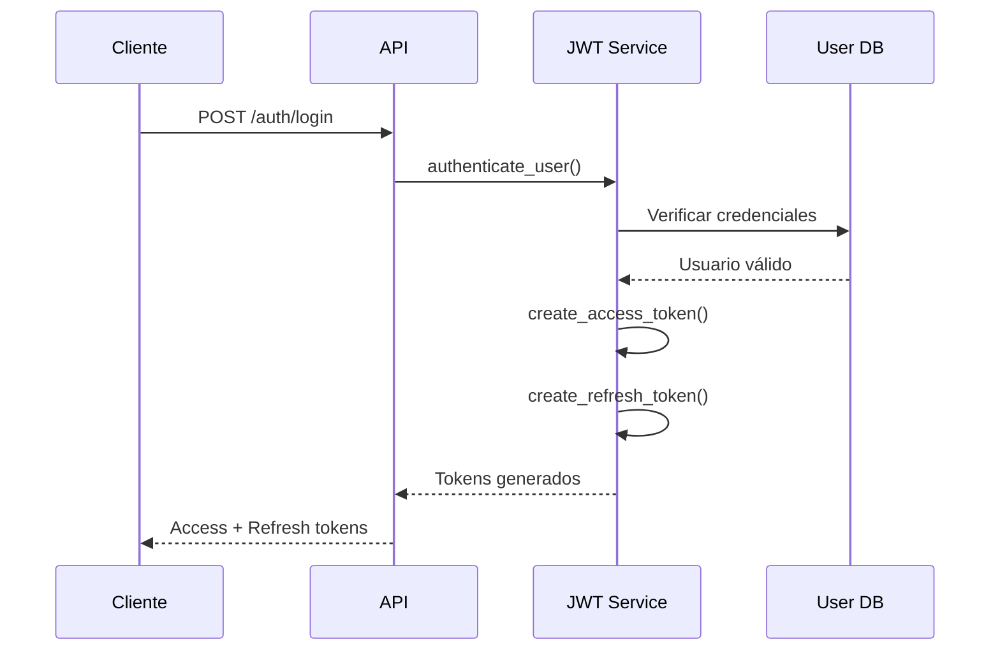
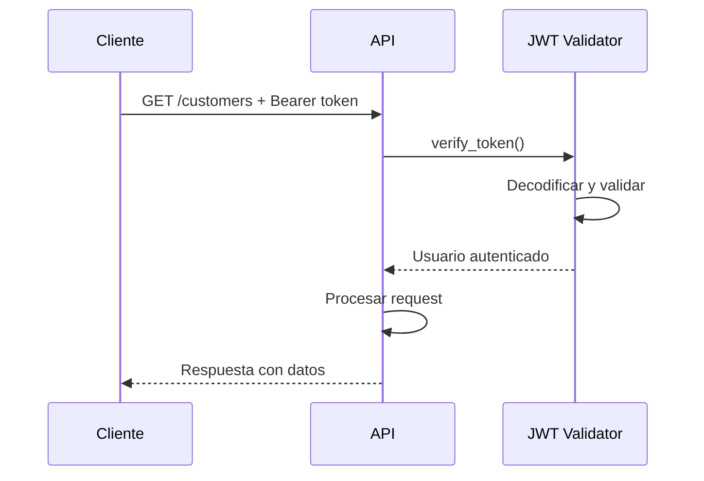
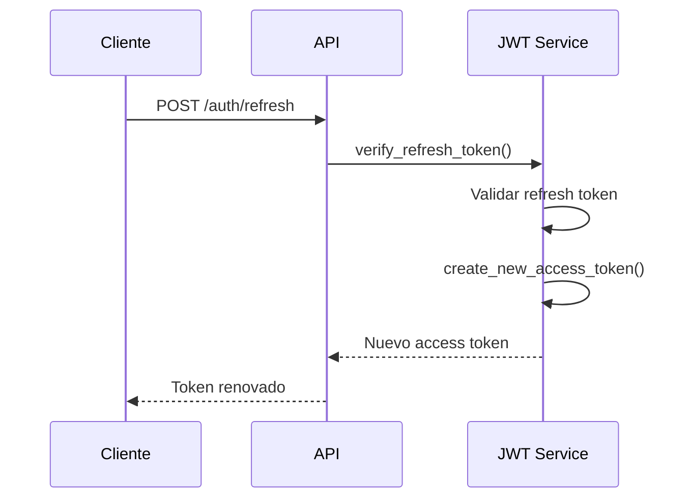

# POC3 Security JWT - Documentación de Autenticación

## 📋 Tabla de Contenidos

1. [Introducción a JWT](#introducción-a-jwt)
2. [Arquitectura de Autenticación](#arquitectura-de-autenticación)
3. [Endpoints de Autenticación](#endpoints-de-autenticación)
4. [Flujo de Autenticación](#flujo-de-autenticación)
5. [Configuración de JWT](#configuración-de-jwt)
6. [Usuarios y Roles](#usuarios-y-roles)
7. [Pruebas de JWT](#pruebas-de-jwt)
8. [Seguridad y Mejores Prácticas](#seguridad-y-mejores-prácticas)
9. [Troubleshooting](#troubleshooting)
10. [Referencias](#referencias)

---

## 🔐 Introducción a JWT

El POC3 Security ahora implementa **autenticación basada en JWT (JSON Web Tokens)** para proporcionar un sistema de autenticación robusto y escalable.

### Características Principales

- **Autenticación JWT** con access tokens y refresh tokens
- **Control de roles** (admin, user)
- **MFA integrado** en el token
- **Expiración automática** de tokens
- **Renovación de tokens** sin re-autenticación
- **Compatibilidad legacy** con el sistema anterior

### Beneficios de JWT

1. **Stateless**: No requiere almacenamiento en servidor
2. **Escalable**: Fácil de distribuir en múltiples servidores
3. **Seguro**: Firmado digitalmente y encriptado
4. **Flexible**: Contiene información del usuario y roles
5. **Estándar**: Basado en RFC 7519

---

## 🏗️ Arquitectura de Autenticación

### Diagrama de Arquitectura JWT

```
┌─────────────────┐    ┌─────────────────┐    ┌─────────────────┐
│   Cliente       │    │   FastAPI       │    │   JWT Service   │
│   (Postman/K6)  │───▶│   POC3 API      │───▶│   (auth.py)     │
│                 │    │                 │    │                 │
└─────────────────┘    └─────────────────┘    └─────────────────┘
         │                       │                       │
         │                       ▼                       ▼
         │              ┌─────────────────┐    ┌─────────────────┐
         │              │   Middleware    │    │   Token Store   │
         │              │   JWT Validator │    │   (Memory)      │
         │              └─────────────────┘    └─────────────────┘
         │                       │
         ▼                       ▼
┌─────────────────┐    ┌─────────────────┐
│   Access Token  │    │   Protected     │
│   (30 min)      │    │   Endpoints     │
└─────────────────┘    └─────────────────┘
```

### Componentes del Sistema

1. **JWT Service** (`poc3_security/auth.py`)
2. **API Endpoints** (`poc3_security/api.py`)
3. **Token Validator** (Middleware FastAPI)
4. **User Database** (Simulada en memoria)
5. **Role Manager** (Control de acceso)

---

## 🌐 Endpoints de Autenticación

### POST /auth/login

**Autenticar usuario y obtener tokens JWT**

#### Request
```json
{
    "username": "admin",
    "password": "admin123"
}
```

#### Response (200 OK)
```json
{
    "access_token": "eyJ0eXAiOiJKV1QiLCJhbGciOiJIUzI1NiJ9...",
    "refresh_token": "eyJ0eXAiOiJKV1QiLCJhbGciOiJIUzI1NiJ9...",
    "token_type": "bearer",
    "expires_in": 1800
}
```

#### Response (401 Unauthorized)
```json
{
    "detail": "Incorrect username or password"
}
```

### POST /auth/refresh

**Renovar access token usando refresh token**

#### Request
```json
{
    "refresh_token": "eyJ0eXAiOiJKV1QiLCJhbGciOiJIUzI1NiJ9..."
}
```

#### Response (200 OK)
```json
{
    "access_token": "eyJ0eXAiOiJKV1QiLCJhbGciOiJIUzI1NiJ9...",
    "refresh_token": "eyJ0eXAiOiJKV1QiLCJhbGciOiJIUzI1NiJ9...",
    "token_type": "bearer",
    "expires_in": 1800
}
```

### GET /auth/me

**Obtener información del usuario actual**

#### Headers
```
Authorization: Bearer <access_token>
```

#### Response (200 OK)
```json
{
    "username": "admin",
    "email": "admin@medisupply.com",
    "full_name": "Administrator",
    "roles": ["admin", "user"],
    "is_active": true
}
```

### GET /auth/demo-tokens

**Obtener tokens de demostración para testing**

#### Response (200 OK)
```json
{
    "admin_token": "eyJ0eXAiOiJKV1QiLCJhbGciOiJIUzI1NiJ9...",
    "user_token": "eyJ0eXAiOiJKV1QiLCJhbGciOiJIUzI1NiJ9...",
    "admin_refresh": "eyJ0eXAiOiJKV1QiLCJhbGciOiJIUzI1NiJ9...",
    "user_refresh": "eyJ0eXAiOiJKV1QiLCJhbGciOiJIUzI1NiJ9..."
}
```

### GET /auth/token-info/{token}

**Obtener información de un token (para debugging)**

#### Response (200 OK)
```json
{
    "sub": "admin",
    "username": "admin",
    "roles": ["admin", "user"],
    "mfa_verified": true,
    "type": "access",
    "exp": 1735728000
}
```

---

## 🔄 Flujo de Autenticación

### 1. Login Inicial



### 2. Acceso a Recursos Protegidos



### 3. Renovación de Token



---

## ⚙️ Configuración de JWT

### Variables de Entorno

```bash
# Clave secreta para firmar JWT (cambiar en producción)
JWT_SECRET_KEY=your-secret-key-change-in-production

# Archivo de clave de encriptación
CRYPTO_KEY_FILE=.devkey
```

### Configuración de Tokens

```python
# Configuración en auth.py
SECRET_KEY = os.getenv("JWT_SECRET_KEY", "your-secret-key-change-in-production")
ALGORITHM = "HS256"
ACCESS_TOKEN_EXPIRE_MINUTES = 30
REFRESH_TOKEN_EXPIRE_DAYS = 7
```

### Estructura del Token

```json
{
    "sub": "admin",                    // Subject (username)
    "username": "admin",               // Username
    "roles": ["admin", "user"],        // Roles del usuario
    "mfa_verified": true,              // MFA verificado
    "type": "access",                  // Tipo de token
    "exp": 1735728000,                 // Expiración (timestamp)
    "iat": 1735726200                  // Emitido en (timestamp)
}
```

---

## 👥 Usuarios y Roles

### Usuarios Predefinidos

#### Administrador
```json
{
    "username": "admin",
    "password": "admin123",
    "email": "admin@medisupply.com",
    "full_name": "Administrator",
    "roles": ["admin", "user"],
    "is_active": true
}
```

#### Usuario Regular 1
```json
{
    "username": "user1",
    "password": "user123",
    "email": "user1@medisupply.com",
    "full_name": "Test User 1",
    "roles": ["user"],
    "is_active": true
}
```

#### Usuario Regular 2
```json
{
    "username": "user2",
    "password": "user123",
    "email": "user2@medisupply.com",
    "full_name": "Test User 2",
    "roles": ["user"],
    "is_active": true
}
```

### Sistema de Roles

#### Rol: `admin`
- **Permisos**: Acceso completo a todos los endpoints
- **Operaciones**: Crear, leer, actualizar, eliminar clientes
- **Endpoints especiales**: DELETE /customers/{email}

#### Rol: `user`
- **Permisos**: Acceso limitado a operaciones básicas
- **Operaciones**: Crear, leer, listar clientes
- **Restricciones**: No puede eliminar clientes

### Control de Acceso

```python
# Ejemplo de uso de roles
@app.delete("/customers/{email}")
def delete_customer(
    email: str,
    current_user: UserInDB = Depends(require_admin_role)
):
    # Solo usuarios con rol 'admin' pueden acceder
    pass
```

---

## 🧪 Pruebas de JWT

### Colección de Postman

**Archivo**: `postman/POC3_Security_JWT.postman_collection.json`

#### Categorías de Pruebas

1. **Authentication (7 pruebas)**
   - Login con usuario admin
   - Login con usuario regular
   - Login con credenciales inválidas
   - Obtener información del usuario actual
   - Renovar token
   - Obtener tokens de demostración
   - Obtener información de token

2. **Customers - JWT Protected (8 pruebas)**
   - Crear cliente con JWT
   - Obtener cliente con JWT
   - Listar todos los clientes
   - Acceso sin JWT (Error 401)
   - Acceso con JWT inválido (Error 401)
   - Eliminar cliente (solo admin)
   - Violación de roles (Error 403)

3. **Security Tests (6 pruebas)**
   - Manipulación de JWT
   - Token expirado
   - Header de autorización malformado
   - Prefijo Bearer faltante
   - Inyección SQL en login
   - XSS en login

4. **Performance Tests (3 pruebas)**
   - Rendimiento de login
   - Rendimiento de validación de token
   - Rendimiento de creación de cliente

5. **Legacy Compatibility (2 pruebas)**
   - Endpoints legacy con JWT
   - Compatibilidad con pruebas existentes

### Scripts de K6

**Archivo**: `scripts/k6_security_jwt.js`

#### Métricas de Pruebas

```javascript
// Métricas personalizadas
const jwtAuthSuccess = new Rate('jwt_auth_success_rate');
const jwtValidationTime = new Trend('jwt_validation_time');
const tokenRefreshSuccess = new Rate('token_refresh_success_rate');
const unauthorizedAccess = new Counter('unauthorized_access_attempts');
const roleViolations = new Counter('role_violation_attempts');
```

#### Objetivos de Rendimiento

- **jwt_auth_success_rate**: > 95%
- **jwt_validation_time**: p95 < 100ms
- **token_refresh_success_rate**: > 99%
- **unauthorized_access_attempts**: < 5
- **role_violation_attempts**: < 3

### Comandos de Ejecución

```bash
# Pruebas de JWT con K6
make test-poc3-jwt

# Pruebas de JWT con Postman
./scripts/postman_poc3_jwt.sh

# Todas las pruebas incluyendo JWT
make test-poc3-all
```

---

## 🛡️ Seguridad y Mejores Prácticas

### Seguridad Implementada

1. **Firma Digital**: Tokens firmados con HMAC-SHA256
2. **Expiración**: Access tokens expiran en 30 minutos
3. **Refresh Tokens**: Válidos por 7 días
4. **Validación Estricta**: Verificación de firma y expiración
5. **Roles y Permisos**: Control granular de acceso
6. **MFA Integrado**: Verificación multi-factor en tokens

### Mejores Prácticas

#### Para Desarrollo
```python
# Usar variables de entorno para secretos
SECRET_KEY = os.getenv("JWT_SECRET_KEY", "fallback-key")

# Validar tokens en cada request
@Depends(get_current_active_user)

# Implementar refresh tokens
refresh_token = create_refresh_token(data)
```

#### Para Producción
```bash
# Usar claves seguras
JWT_SECRET_KEY=$(openssl rand -base64 32)

# Configurar HTTPS
# Implementar rate limiting
# Usar tokens cortos (15-30 minutos)
# Implementar blacklist de tokens
```

### Vulnerabilidades Prevenidas

1. **Token Theft**: Expiración automática
2. **Replay Attacks**: Timestamps y nonces
3. **Token Manipulation**: Firma digital
4. **Privilege Escalation**: Validación de roles
5. **Session Fixation**: Tokens únicos por sesión

---

## 🔧 Troubleshooting

### Problemas Comunes

#### 1. Error 401 - Unauthorized
```bash
# Problema: Token inválido o expirado
# Solución: Verificar token y renovar si es necesario
curl -H "Authorization: Bearer <token>" http://localhost:8083/auth/me
```

#### 2. Error 403 - Forbidden
```bash
# Problema: Rol insuficiente
# Solución: Usar usuario con rol apropiado
# Para operaciones de admin, usar usuario 'admin'
```

#### 3. Token Expirado
```bash
# Problema: Access token expirado
# Solución: Usar refresh token para renovar
curl -X POST -H "Content-Type: application/json" \
  -d '{"refresh_token":"<refresh_token>"}' \
  http://localhost:8083/auth/refresh
```

#### 4. Error de Validación
```bash
# Problema: Token malformado
# Solución: Verificar formato del token
# Debe ser: "Bearer <token>"
```

### Verificación de Estado

```bash
# Verificar que POC3 esté ejecutándose
curl http://localhost:8083/auth/demo-tokens

# Obtener tokens de demostración
curl http://localhost:8083/auth/demo-tokens

# Verificar información de token
curl http://localhost:8083/auth/token-info/<token>

# Probar autenticación
curl -X POST -H "Content-Type: application/json" \
  -d '{"username":"admin","password":"admin123"}' \
  http://localhost:8083/auth/login
```

### Logs y Debugging

```bash
# Ver logs de la aplicación
docker-compose logs api_poc3

# Ver logs con timestamps
docker-compose logs -t api_poc3

# Ver logs de autenticación
docker-compose logs api_poc3 | grep -i auth
```

---

## 📚 Referencias

### Documentación Oficial
- [JWT.io](https://jwt.io/) - Herramientas y documentación JWT
- [RFC 7519](https://tools.ietf.org/html/rfc7519) - Especificación JWT
- [PyJWT Documentation](https://pyjwt.readthedocs.io/)
- [FastAPI Security](https://fastapi.tiangolo.com/tutorial/security/)

### Herramientas de Testing
- [Postman JWT Testing](https://learning.postman.com/docs/sending-requests/authorization/#bearer-token)
- [K6 JWT Testing](https://k6.io/docs/examples/jwt-authentication/)
- [JWT Debugger](https://jwt.io/#debugger-io)

### Mejores Prácticas de Seguridad
- [OWASP JWT Security](https://owasp.org/www-community/attacks/JSON_Web_Token_(JWT)_Attacks)
- [JWT Security Best Practices](https://auth0.com/blog/a-look-at-the-latest-draft-for-jwt-bcp/)
- [Token Security Guidelines](https://tools.ietf.org/html/draft-ietf-oauth-security-topics)

### Estándares Relacionados
- [OAuth 2.0](https://tools.ietf.org/html/rfc6749)
- [OpenID Connect](https://openid.net/connect/)
- [JOSE (JSON Object Signing and Encryption)](https://tools.ietf.org/html/rfc7515)

---

## 📞 Soporte y Contacto

### Issues y Bugs
- **GitHub Issues**: Reportar problemas en el repositorio
- **Documentación**: Consultar esta guía primero
- **Logs**: Incluir logs relevantes al reportar

### Contribuciones
- **Contributing Guide**: Ver `CONTRIBUTING.md`
- **Code Review**: Seguir estándares del proyecto
- **Testing**: Agregar pruebas para nuevas funcionalidades

### Contacto del Equipo
- **Email**: dev@medisupply.com
- **GitHub**: [@medisupply](https://github.com/medisupply)
- **Documentación**: [Wiki del Proyecto](https://github.com/medisupply/medisupply-pocs-with-postman-k6-ci-newman/wiki)

---

**Última actualización**: $(date)
**Versión del documento**: 1.0.0
**Autor**: Equipo de Desarrollo MediSupply
