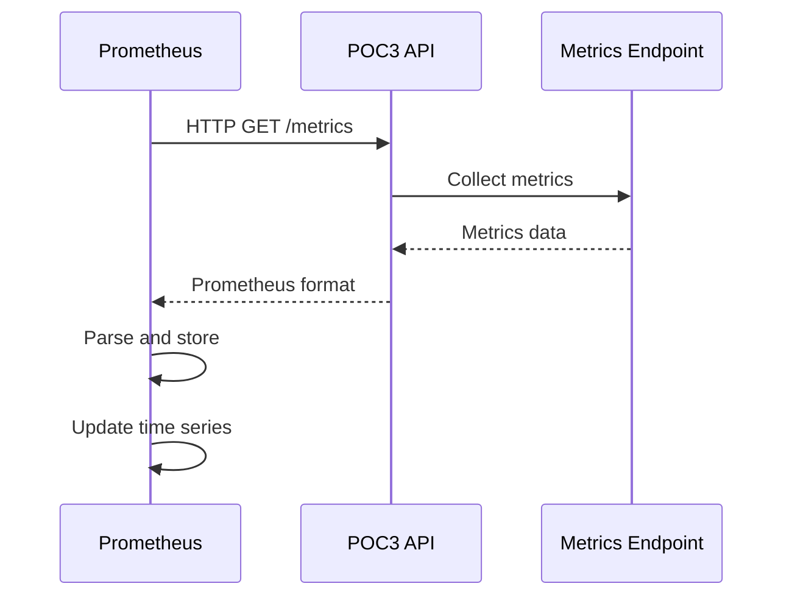

# Prometheus en POC3 Security - Guía de Métricas y Monitoreo

## 📋 Tabla de Contenidos

1. [Introducción a Prometheus en POC3](#introducción-a-prometheus-en-poc3)
2. [Arquitectura de Métricas](#arquitectura-de-métricas)
3. [Configuración de Prometheus](#configuración-de-prometheus)
4. [Métricas del POC3](#métricas-del-poc3)
5. [Scraping y Recolección](#scraping-y-recolección)
6. [Almacenamiento de Datos](#almacenamiento-de-datos)
7. [Consultas PromQL](#consultas-promql)
8. [Integración con Grafana](#integración-con-grafana)
9. [Alertas y Reglas](#alertas-y-reglas)
10. [Troubleshooting](#troubleshooting)
11. [Mejores Prácticas](#mejores-prácticas)

---

## 🎯 Introducción a Prometheus en POC3

Prometheus en el POC3 Security actúa como el **sistema de recolección y almacenamiento de métricas**, proporcionando la base de datos de series temporales que alimenta Grafana y otros sistemas de monitoreo.

### ¿Qué hace Prometheus en POC3?

1. **Recolección de Métricas**: Scraping automático de endpoints de métricas
2. **Almacenamiento**: Base de datos de series temporales eficiente
3. **Consultas**: Lenguaje PromQL para análisis de datos
4. **Alertas**: Evaluación de reglas y notificaciones
5. **Integración**: Conecta con Grafana para visualización

### Beneficios para POC3

- **Métricas en Tiempo Real**: Datos actualizados constantemente
- **Almacenamiento Eficiente**: Compresión y retención optimizada
- **Consultas Poderosas**: PromQL para análisis complejos
- **Alertas Proactivas**: Detección temprana de problemas
- **Escalabilidad**: Manejo de grandes volúmenes de métricas

---

## 🏗️ Arquitectura de Métricas

### Diagrama de Arquitectura Prometheus

```
┌─────────────────────────────────────────────────────────────┐
│                    POC3 Security                            │
│  ┌─────────────────┐    ┌─────────────────┐                │
│  │   FastAPI App   │    │   Middleware    │                │
│  │   (api.py)      │───▶│   Observability │                │
│  │   Port: 8083    │    │   (metrics.py)  │                │
│  └─────────────────┘    └─────────────────┘                │
│           │                       │                        │
│           ▼                       ▼                        │
│  ┌─────────────────┐    ┌─────────────────┐                │
│  │   /metrics      │    │   Prometheus    │                │
│  │   Endpoint      │◄───│   Server        │                │
│  │   (Exporter)    │    │   Port: 9090    │                │
│  └─────────────────┘    └─────────────────┘                │
│                                   │                        │
│                                   ▼                        │
│                          ┌─────────────────┐                │
│                          │   Time Series   │                │
│                          │   Database      │                │
│                          │   (TSDB)        │                │
│                          └─────────────────┘                │
│                                   │                        │
│                                   ▼                        │
│                          ┌─────────────────┐                │
│                          │     Grafana     │                │
│                          │   (Consumer)    │                │
│                          └─────────────────┘                │
└─────────────────────────────────────────────────────────────┘
```

### Componentes del Sistema

1. **POC3 API** - Genera métricas en formato Prometheus
2. **Prometheus Server** - Recolecta, almacena y consulta métricas
3. **Time Series Database (TSDB)** - Almacenamiento optimizado
4. **Grafana** - Consume métricas para visualización

---

## ⚙️ Configuración de Prometheus

### Docker Compose Configuration

```yaml
# docker-compose.yml
prometheus:
  image: prom/prometheus
  volumes: 
    - "./observability/prometheus.yml:/etc/prometheus/prometheus.yml:ro"
  ports: 
    - "9090:9090"
  command:
    - '--config.file=/etc/prometheus/prometheus.yml'
    - '--storage.tsdb.path=/prometheus'
    - '--web.console.libraries=/etc/prometheus/console_libraries'
    - '--web.console.templates=/etc/prometheus/consoles'
    - '--storage.tsdb.retention.time=30d'
    - '--web.enable-lifecycle'
```

### Archivo de Configuración

```yaml
# observability/prometheus.yml
global:
  scrape_interval: 15s
  evaluation_interval: 15s

rule_files:
  - "prometheus_rules.yml"

alerting:
  alertmanagers:
    - static_configs:
        - targets:
          - alertmanager:9093

scrape_configs:
  - job_name: 'poc3-security'
    static_configs:
      - targets: ['api_poc3:8083']
    metrics_path: '/metrics'
    scrape_interval: 5s
    scrape_timeout: 5s
    
  - job_name: 'prometheus'
    static_configs:
      - targets: ['localhost:9090']
```

### Variables de Configuración

```yaml
# Configuración global
global:
  scrape_interval: 15s          # Intervalo de scraping
  evaluation_interval: 15s      # Intervalo de evaluación de reglas
  external_labels:              # Etiquetas externas
    cluster: 'poc3-cluster'
    environment: 'development'

# Configuración de scraping
scrape_configs:
  - job_name: 'poc3-security'
    scrape_interval: 5s         # Scraping más frecuente para POC3
    scrape_timeout: 5s          # Timeout de scraping
    metrics_path: '/metrics'    # Ruta del endpoint de métricas
    honor_labels: true          # Respetar etiquetas del target
```

---

## 📊 Métricas del POC3

### Endpoint de Métricas

**URL**: `http://localhost:8083/metrics`

#### Formato de Métricas Prometheus

```
# HELP http_requests_total Total number of HTTP requests
# TYPE http_requests_total counter
http_requests_total{method="POST",endpoint="/customers",status="200"} 10
http_requests_total{method="GET",endpoint="/customers",status="200"} 15
http_requests_total{method="POST",endpoint="/auth/login",status="200"} 5

# HELP http_request_duration_seconds HTTP request duration in seconds
# TYPE http_request_duration_seconds histogram
http_request_duration_seconds_bucket{method="POST",endpoint="/customers",le="0.1"} 8
http_request_duration_seconds_bucket{method="POST",endpoint="/customers",le="0.5"} 10
http_request_duration_seconds_bucket{method="POST",endpoint="/customers",le="1.0"} 10
http_request_duration_seconds_count{method="POST",endpoint="/customers"} 10
http_request_duration_seconds_sum{method="POST",endpoint="/customers"} 2.5

# HELP jwt_tokens_created_total Total JWT tokens created
# TYPE jwt_tokens_created_total counter
jwt_tokens_created_total{token_type="access",user_role="admin"} 3
jwt_tokens_created_total{token_type="access",user_role="user"} 7
jwt_tokens_created_total{token_type="refresh",user_role="admin"} 3
jwt_tokens_created_total{token_type="refresh",user_role="user"} 7

# HELP jwt_active_tokens Number of active JWT tokens
# TYPE jwt_active_tokens gauge
jwt_active_tokens 10

# HELP encryption_operations_total Total encryption operations
# TYPE encryption_operations_total counter
encryption_operations_total{operation_type="encrypt",field_type="email"} 15
encryption_operations_total{operation_type="encrypt",field_type="phone"} 15
encryption_operations_total{operation_type="decrypt",field_type="email"} 12
encryption_operations_total{operation_type="decrypt",field_type="phone"} 12
```

### Tipos de Métricas

#### 1. Counters (Contadores)

```python
# Métricas de contador - solo incrementan
http_requests_total = Counter(
    'http_requests_total', 
    'Total HTTP requests',
    ['method', 'endpoint', 'status']
)

jwt_tokens_created_total = Counter(
    'jwt_tokens_created_total',
    'Total JWT tokens created',
    ['token_type', 'user_role']
)
```

**Uso**: Número total de requests, tokens creados, errores acumulados

#### 2. Gauges (Medidores)

```python
# Métricas de gauge - pueden subir y bajar
jwt_active_tokens = Gauge(
    'jwt_active_tokens',
    'Number of active JWT tokens'
)

http_connections_active = Gauge(
    'http_connections_active',
    'Active HTTP connections'
)
```

**Uso**: Tokens activos, conexiones actuales, uso de memoria

#### 3. Histograms (Histogramas)

```python
# Métricas de histograma - distribución de valores
http_request_duration_seconds = Histogram(
    'http_request_duration_seconds',
    'HTTP request duration in seconds',
    ['method', 'endpoint'],
    buckets=[0.1, 0.5, 1.0, 2.5, 5.0, 10.0]
)

jwt_token_validation_duration_seconds = Histogram(
    'jwt_token_validation_duration_seconds',
    'JWT token validation duration',
    ['validation_result']
)
```

**Uso**: Tiempo de respuesta, latencia, tamaño de requests

#### 4. Summaries (Resúmenes)

```python
# Métricas de resumen - percentiles calculados
encryption_duration_seconds = Summary(
    'encryption_duration_seconds',
    'Encryption operation duration',
    ['operation_type', 'field_type']
)
```

**Uso**: Tiempo de encriptación, percentiles de latencia

---

## 🔄 Scraping y Recolección

### Proceso de Scraping

#### 1. Configuración de Targets

```yaml
# prometheus.yml
scrape_configs:
  - job_name: 'poc3-security'
    static_configs:
      - targets: ['api_poc3:8083']  # Target del POC3
    metrics_path: '/metrics'         # Endpoint de métricas
    scrape_interval: 5s              # Cada 5 segundos
    scrape_timeout: 5s               # Timeout de 5 segundos
```

#### 2. Proceso de Recolección



#### 3. Frecuencia de Scraping

```yaml
# Configuración optimizada para POC3
scrape_configs:
  - job_name: 'poc3-security'
    scrape_interval: 5s      # Frecuente para métricas de seguridad
    scrape_timeout: 5s       # Timeout apropiado
    honor_labels: true       # Respetar etiquetas del target
    honor_timestamps: true   # Usar timestamps del target
```

### Manejo de Errores

#### 1. Targets No Disponibles

```yaml
# Configuración con reintentos
scrape_configs:
  - job_name: 'poc3-security'
    static_configs:
      - targets: ['api_poc3:8083']
    scrape_interval: 5s
    scrape_timeout: 5s
    sample_limit: 1000       # Límite de muestras
    target_limit: 100        # Límite de targets
```

#### 2. Métricas Malformadas

```python
# En el código del POC3
try:
    # Generar métricas
    http_requests_total.labels(
        method=request.method,
        endpoint=request.url.path,
        status=response.status_code
    ).inc()
except Exception as e:
    # Log error pero no fallar
    logger.error(f"Error generating metrics: {e}")
```

---

## 💾 Almacenamiento de Datos

### Time Series Database (TSDB)

#### 1. Estructura de Datos

```
# Serie temporal de ejemplo
http_requests_total{method="POST",endpoint="/customers",status="200"}

# Puntos de datos
timestamp=1640995200, value=10
timestamp=1640995205, value=11
timestamp=1640995210, value=12
```

#### 2. Compresión y Retención

```yaml
# Configuración de almacenamiento
command:
  - '--storage.tsdb.path=/prometheus'
  - '--storage.tsdb.retention.time=30d'      # Retener 30 días
  - '--storage.tsdb.retention.size=10GB'     # Máximo 10GB
  - '--storage.tsdb.wal-compression'         # Compresión WAL
```

#### 3. Optimización de Almacenamiento

```yaml
# Configuración optimizada
command:
  - '--storage.tsdb.min-block-duration=2h'   # Bloques mínimos
  - '--storage.tsdb.max-block-duration=25h'  # Bloques máximos
  - '--storage.tsdb.max-series=1000000'      # Máximo de series
  - '--storage.tsdb.max-samples-per-query=50000000'  # Máximo por query
```

### Etiquetas y Metadatos

#### 1. Etiquetas de Métricas

```python
# Etiquetas estructuradas
http_requests_total.labels(
    method="POST",           # Método HTTP
    endpoint="/customers",   # Endpoint
    status="200",           # Código de estado
    user_role="admin"       # Rol del usuario
).inc()
```

#### 2. Etiquetas de Sistema

```yaml
# Etiquetas globales
global:
  external_labels:
    cluster: 'poc3-cluster'
    environment: 'development'
    service: 'poc3-security'
    version: '1.0.0'
```

---

## 🔍 Consultas PromQL

### Consultas Básicas

#### 1. Métricas Simples

```promql
# Número total de requests
http_requests_total

# Requests por método
http_requests_total{method="POST"}

# Requests por endpoint
http_requests_total{endpoint="/customers"}

# Requests con múltiples etiquetas
http_requests_total{method="POST",endpoint="/customers",status="200"}
```

#### 2. Agregaciones

```promql
# Suma total de requests
sum(http_requests_total)

# Requests por método
sum by (method) (http_requests_total)

# Requests por endpoint
sum by (endpoint) (http_requests_total)

# Top 5 endpoints
topk(5, sum by (endpoint) (http_requests_total))
```

### Consultas de Tasa

#### 1. Rate de Requests

```promql
# Requests por segundo
rate(http_requests_total[5m])

# Requests por segundo por endpoint
rate(http_requests_total[5m]) by (endpoint)

# Requests por segundo por método
rate(http_requests_total[5m]) by (method)
```

#### 2. Rate de Errores

```promql
# Tasa de errores 4xx
rate(http_requests_total{status=~"4.."}[5m])

# Tasa de errores 5xx
rate(http_requests_total{status=~"5.."}[5m])

# Porcentaje de errores
rate(http_requests_total{status=~"5.."}[5m]) / rate(http_requests_total[5m]) * 100
```

### Consultas de Latencia

#### 1. Latencia Promedio

```promql
# Latencia promedio
rate(http_request_duration_seconds_sum[5m]) / rate(http_request_duration_seconds_count[5m])

# Latencia por endpoint
rate(http_request_duration_seconds_sum[5m]) by (endpoint) / rate(http_request_duration_seconds_count[5m]) by (endpoint)
```

#### 2. Percentiles

```promql
# Percentil 95 de latencia
histogram_quantile(0.95, rate(http_request_duration_seconds_bucket[5m]))

# Percentil 99 de latencia
histogram_quantile(0.99, rate(http_request_duration_seconds_bucket[5m]))

# Percentiles por endpoint
histogram_quantile(0.95, rate(http_request_duration_seconds_bucket[5m]) by (endpoint))
```

### Consultas de JWT

#### 1. Métricas de Autenticación

```promql
# Tokens creados por segundo
rate(jwt_tokens_created_total[5m])

# Tokens activos
jwt_active_tokens

# Tokens por tipo
sum by (token_type) (jwt_tokens_created_total)

# Tokens por rol de usuario
sum by (user_role) (jwt_tokens_created_total)
```

#### 2. Métricas de Seguridad

```promql
# Intentos de login fallidos
rate(http_requests_total{endpoint="/auth/login",status="401"}[5m])

# Login exitosos
rate(http_requests_total{endpoint="/auth/login",status="200"}[5m])

# Tasa de éxito de login
rate(http_requests_total{endpoint="/auth/login",status="200"}[5m]) / 
rate(http_requests_total{endpoint="/auth/login"}[5m]) * 100
```

### Consultas de Encriptación

#### 1. Operaciones de Encriptación

```promql
# Operaciones de encriptación por segundo
rate(encryption_operations_total[5m])

# Encriptación por tipo de campo
sum by (field_type) (encryption_operations_total)

# Encriptación vs desencriptación
sum by (operation_type) (encryption_operations_total)
```

#### 2. Rendimiento de Encriptación

```promql
# Tiempo promedio de encriptación
rate(encryption_duration_seconds_sum[5m]) / rate(encryption_duration_seconds_count[5m])

# Tiempo de encriptación por tipo
rate(encryption_duration_seconds_sum[5m]) by (operation_type) / 
rate(encryption_duration_seconds_count[5m]) by (operation_type)
```

---

## 📈 Integración con Grafana

### Configuración de Data Source

#### 1. Configuración en Grafana

```yaml
# Configuración de data source
datasources:
  - name: Prometheus
    type: prometheus
    url: http://prometheus:9090
    access: proxy
    isDefault: true
    editable: true
```

#### 2. Variables de Grafana

```yaml
# Variables para dashboards
templating:
  variables:
    - name: instance
      type: query
      query: label_values(http_requests_total, instance)
      refresh: 1
    - name: endpoint
      type: query
      query: label_values(http_requests_total, endpoint)
      refresh: 1
```

### Dashboards Automáticos

#### 1. Dashboard de HTTP

```json
{
  "dashboard": {
    "title": "POC3 HTTP Metrics",
    "panels": [
      {
        "title": "Request Rate",
        "type": "graph",
        "targets": [
          {
            "expr": "rate(http_requests_total[5m])",
            "legendFormat": "{{method}} {{endpoint}}"
          }
        ]
      }
    ]
  }
}
```

#### 2. Dashboard de JWT

```json
{
  "dashboard": {
    "title": "POC3 JWT Metrics",
    "panels": [
      {
        "title": "Active Tokens",
        "type": "stat",
        "targets": [
          {
            "expr": "jwt_active_tokens",
            "legendFormat": "Active Tokens"
          }
        ]
      }
    ]
  }
}
```

---

## 🚨 Alertas y Reglas

### Configuración de Reglas

#### 1. Archivo de Reglas

```yaml
# observability/prometheus_rules.yml
groups:
- name: poc3_security
  rules:
  - alert: HighErrorRate
    expr: rate(http_requests_total{status=~"5.."}[5m]) / rate(http_requests_total[5m]) > 0.05
    for: 2m
    labels:
      severity: warning
    annotations:
      summary: "High error rate detected"
      description: "Error rate is {{ $value | humanizePercentage }}"

  - alert: HighLatency
    expr: histogram_quantile(0.95, rate(http_request_duration_seconds_bucket[5m])) > 1
    for: 5m
    labels:
      severity: warning
    annotations:
      summary: "High latency detected"
      description: "95th percentile latency is {{ $value }}s"

  - alert: NoActiveTokens
    expr: jwt_active_tokens == 0
    for: 1m
    labels:
      severity: critical
    annotations:
      summary: "No active JWT tokens"
      description: "All JWT tokens have expired"
```

#### 2. Reglas de Seguridad

```yaml
# Reglas específicas de seguridad
- alert: HighFailedLogins
  expr: rate(http_requests_total{endpoint="/auth/login",status="401"}[5m]) > 5
  for: 2m
  labels:
    severity: warning
  annotations:
    summary: "High failed login rate"
    description: "{{ $value }} failed logins per second"

- alert: SuspiciousActivity
  expr: rate(http_requests_total{status="401"}[5m]) > 10
  for: 1m
  labels:
    severity: critical
  annotations:
    summary: "Suspicious activity detected"
    description: "High rate of unauthorized requests"
```

### Configuración de Alertmanager

#### 1. Alertmanager Config

```yaml
# observability/alertmanager.yml
global:
  smtp_smarthost: 'localhost:587'
  smtp_from: 'alerts@medisupply.com'

route:
  group_by: ['alertname']
  group_wait: 10s
  group_interval: 10s
  repeat_interval: 1h
  receiver: 'web.hook'

receivers:
- name: 'web.hook'
  webhook_configs:
  - url: 'http://localhost:5001/'
    send_resolved: true

- name: 'email'
  email_configs:
  - to: 'admin@medisupply.com'
    subject: 'POC3 Security Alert: {{ .GroupLabels.alertname }}'
    body: |
      {{ range .Alerts }}
      Alert: {{ .Annotations.summary }}
      Description: {{ .Annotations.description }}
      {{ end }}
```

---

## 🔧 Troubleshooting

### Problemas Comunes

#### 1. Prometheus No Inicia

```bash
# Verificar logs
docker-compose logs prometheus

# Verificar configuración
docker-compose exec prometheus promtool check config /etc/prometheus/prometheus.yml

# Verificar puerto
lsof -i :9090
```

#### 2. No Se Recolectan Métricas

```bash
# Verificar endpoint de métricas
curl http://localhost:8083/metrics

# Verificar targets en Prometheus
curl http://localhost:9090/api/v1/targets

# Verificar configuración de scraping
curl http://localhost:9090/api/v1/targets?state=active
```

#### 3. Métricas No Aparecen

```bash
# Verificar que el target esté activo
curl http://localhost:9090/api/v1/targets

# Verificar métricas disponibles
curl http://localhost:9090/api/v1/label/__name__/values

# Verificar consultas
curl 'http://localhost:9090/api/v1/query?query=http_requests_total'
```

### Verificación de Estado

#### 1. Health Checks

```bash
# Verificar estado de Prometheus
curl http://localhost:9090/-/healthy

# Verificar estado del POC3
curl http://localhost:8083/metrics

# Verificar targets
curl http://localhost:9090/api/v1/targets
```

#### 2. Métricas del Sistema

```bash
# Verificar métricas de Prometheus
curl http://localhost:9090/metrics

# Verificar uso de memoria
curl 'http://localhost:9090/api/v1/query?query=prometheus_tsdb_head_series'

# Verificar almacenamiento
curl 'http://localhost:9090/api/v1/query?query=prometheus_tsdb_storage_blocks_bytes'
```

### Logs de Debugging

```bash
# Logs de Prometheus
docker-compose logs -f prometheus

# Logs del POC3
docker-compose logs -f api_poc3

# Logs con timestamps
docker-compose logs -t prometheus
```

---

## 📚 Mejores Prácticas

### 1. Configuración de Métricas

#### Nomenclatura

```python
# ✅ Bueno: Nombres descriptivos
http_requests_total
jwt_tokens_created_total
encryption_operations_total

# ❌ Malo: Nombres confusos
requests
tokens
ops
```

#### Etiquetas

```python
# ✅ Bueno: Etiquetas estructuradas
http_requests_total.labels(
    method="POST",
    endpoint="/customers",
    status="200",
    user_role="admin"
)

# ❌ Malo: Demasiadas etiquetas
http_requests_total.labels(
    method="POST",
    endpoint="/customers",
    status="200",
    user_role="admin",
    user_id="12345",
    session_id="abc123",
    ip_address="192.168.1.1"
)
```

### 2. Configuración de Scraping

#### Intervalos Apropiados

```yaml
# ✅ Bueno: Intervalos balanceados
scrape_configs:
  - job_name: 'poc3-security'
    scrape_interval: 5s      # Frecuente para métricas críticas
    scrape_timeout: 5s

  - job_name: 'system'
    scrape_interval: 15s     # Menos frecuente para métricas del sistema
    scrape_timeout: 10s
```

#### Timeouts

```yaml
# ✅ Bueno: Timeouts apropiados
scrape_configs:
  - job_name: 'poc3-security'
    scrape_timeout: 5s       # Timeout corto para API rápida

  - job_name: 'database'
    scrape_timeout: 30s      # Timeout largo para operaciones lentas
```

### 3. Almacenamiento

#### Retención

```yaml
# ✅ Bueno: Retención balanceada
command:
  - '--storage.tsdb.retention.time=30d'      # 30 días para desarrollo
  - '--storage.tsdb.retention.size=10GB'     # Límite de tamaño

# Para producción
command:
  - '--storage.tsdb.retention.time=90d'      # 90 días para producción
  - '--storage.tsdb.retention.size=100GB'    # Límite mayor
```

#### Compresión

```yaml
# ✅ Bueno: Compresión habilitada
command:
  - '--storage.tsdb.wal-compression'         # Compresión WAL
  - '--storage.tsdb.min-block-duration=2h'   # Bloques optimizados
```

### 4. Consultas Eficientes

#### Consultas Optimizadas

```promql
# ✅ Bueno: Consultas específicas
rate(http_requests_total{endpoint="/customers"}[5m])

# ❌ Malo: Consultas muy amplias
rate(http_requests_total[5m])
```

#### Agregaciones

```promql
# ✅ Bueno: Agregaciones apropiadas
sum by (endpoint) (rate(http_requests_total[5m]))

# ❌ Malo: Agregaciones innecesarias
sum(rate(http_requests_total[5m]))
```

---

## 🎯 Métricas Recomendadas para POC3

### 1. Métricas de Aplicación

```promql
# SLI (Service Level Indicators)
# Disponibilidad
rate(http_requests_total{status!~"5.."}[5m]) / rate(http_requests_total[5m])

# Latencia
histogram_quantile(0.95, rate(http_request_duration_seconds_bucket[5m]))

# Throughput
rate(http_requests_total[5m])

# Error Rate
rate(http_requests_total{status=~"5.."}[5m]) / rate(http_requests_total[5m])
```

### 2. Métricas de Seguridad

```promql
# Autenticación
rate(jwt_tokens_created_total[5m])
jwt_active_tokens
rate(http_requests_total{endpoint="/auth/login",status="401"}[5m])

# Autorización
rate(http_requests_total{status="403"}[5m])
rate(security_events_total[5m])

# Encriptación
rate(encryption_operations_total[5m])
histogram_quantile(0.95, rate(encryption_duration_seconds_bucket[5m]))
```

### 3. Métricas de Negocio

```promql
# Usuarios activos
jwt_active_tokens

# Operaciones de datos sensibles
rate(http_requests_total{endpoint=~"/customers.*"}[5m])

# Tiempo de respuesta de encriptación
histogram_quantile(0.95, rate(encryption_duration_seconds_bucket[5m]))
```

---

## 🎯 Conclusión

Prometheus en el POC3 Security proporciona:

### ✅ **Beneficios Logrados**

1. **Recolección Automática**: Métricas recolectadas cada 5 segundos
2. **Almacenamiento Eficiente**: TSDB optimizado para series temporales
3. **Consultas Poderosas**: PromQL para análisis complejos
4. **Alertas Proactivas**: Detección temprana de problemas
5. **Integración Completa**: Con Grafana para visualización

### 🔧 **Características Técnicas**

- **Scraping Configurable**: Intervalos y timeouts personalizables
- **Métricas Estructuradas**: Etiquetas organizadas y consistentes
- **Almacenamiento Optimizado**: Compresión y retención configurable
- **Consultas Eficientes**: PromQL para análisis en tiempo real
- **Alertas Inteligentes**: Reglas basadas en umbrales y patrones

### 🚀 **Próximos Pasos**

1. **Implementar más métricas** específicas de seguridad
2. **Configurar alertas avanzadas** con machine learning
3. **Optimizar consultas** para mejor rendimiento
4. **Implementar métricas de negocio** personalizadas
5. **Configurar retención** según necesidades de compliance

---

**Última actualización**: $(date)
**Versión del documento**: 1.0.0
**Autor**: Equipo de Desarrollo MediSupply
