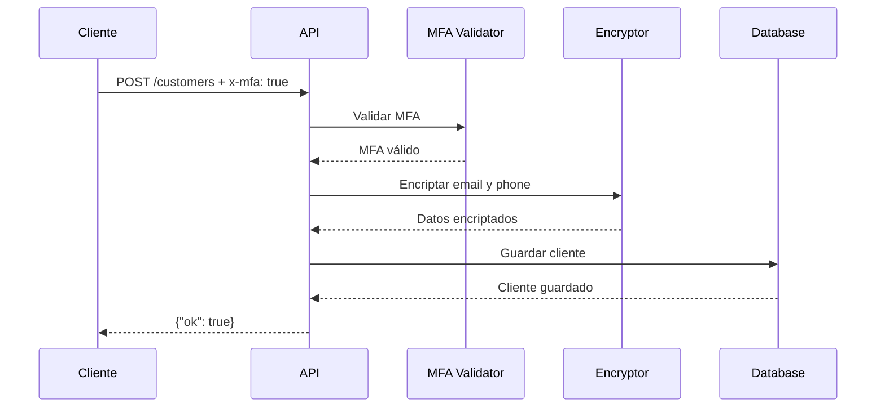
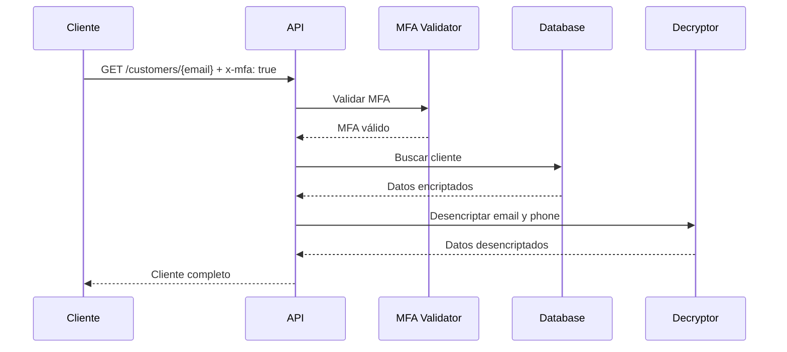

# POC3 Security - Documentación Técnica Completa

## 📋 Tabla de Contenidos

1. [Introducción](#introducción)
2. [Arquitectura del Sistema](#arquitectura-del-sistema)
3. [Componentes Principales](#componentes-principales)
4. [Flujo de Seguridad](#flujo-de-seguridad)
5. [Características de Seguridad](#características-de-seguridad)
6. [Modelo de Datos](#modelo-de-datos)
7. [Suite de Pruebas](#suite-de-pruebas)
8. [Comandos de Ejecución](#comandos-de-ejecución)
9. [Endpoints de la API](#endpoints-de-la-api)
10. [Tecnologías Utilizadas](#tecnologías-utilizadas)
11. [Aspectos de Seguridad](#aspectos-de-seguridad)
12. [Métricas de Rendimiento](#métricas-de-rendimiento)
13. [Casos de Uso Reales](#casos-de-uso-reales)
14. [Troubleshooting](#troubleshooting)
15. [Referencias](#referencias)

---

## 🎯 Introducción

El **POC3 Security** es un sistema de seguridad robusto que demuestra las mejores prácticas en el manejo seguro de datos sensibles. Implementa autenticación multi-factor (MFA), encriptación de campos sensibles y validación estricta de seguridad.

### Objetivos Principales

- **Autenticación Multi-Factor (MFA)** obligatoria para todas las operaciones
- **Encriptación de campos sensibles** (email y teléfono) usando Fernet
- **Validación estricta** de headers de seguridad
- **Manejo seguro de datos** de clientes con auditoría completa
- **Resistencia a vulnerabilidades** comunes de seguridad

---

## 🏗️ Arquitectura del Sistema

### Diagrama de Arquitectura

```
┌─────────────────┐    ┌─────────────────┐    ┌─────────────────┐
│   Cliente       │    │   FastAPI       │    │   Sistema de    │
│   (Postman/K6)  │───▶│   POC3 API      │───▶│   Cifrado       │
│                 │    │                 │    │   (Fernet)      │
└─────────────────┘    └─────────────────┘    └─────────────────┘
                              │
                              ▼
                       ┌─────────────────┐
                       │   Base de       │
                       │   Datos         │
                       │   (Encriptada)  │
                       └─────────────────┘
```

### Componentes del Sistema

1. **API FastAPI** - Servidor web principal
2. **Módulo de Cifrado** - Manejo de encriptación/desencriptación
3. **Middleware de Observabilidad** - Métricas y logging
4. **Base de Datos en Memoria** - Almacenamiento temporal
5. **Sistema de Validación** - Validación de entrada y MFA

---

## 🔧 Componentes Principales

### 1. API Principal (`poc3_security/api.py`)

```python
from fastapi import FastAPI, Depends, HTTPException, Header
from pydantic import BaseModel
from common.observability import MetricsMiddleware, metrics_asgi_app
from poc3_security.crypto import encrypt_field, decrypt_field

app = FastAPI(title="POC3 Security")
app.add_middleware(MetricsMiddleware)
app.mount("/metrics", metrics_asgi_app())
```

#### Funcionalidades Clave:

- **`require_mfa()`**: Valida que el header `x-mfa` sea exactamente "true"
- **`create_customer()`**: Crea cliente con encriptación de campos sensibles
- **`get_customer()`**: Lee cliente y desencripta datos automáticamente

### 2. Sistema de Cifrado (`poc3_security/crypto.py`)

```python
from cryptography.fernet import Fernet
import os

KEY_FILE = os.getenv("CRYPTO_KEY_FILE", ".devkey")

def load_key():
    if not os.path.exists(KEY_FILE):
        with open(KEY_FILE, "wb") as f: 
            f.write(Fernet.generate_key())
    with open(KEY_FILE, "rb") as f: 
        return f.read()

FERNET = Fernet(load_key())
```

#### Características del Cifrado:

- **Algoritmo**: Fernet (AES 128 en modo CBC con HMAC)
- **Generación de Clave**: Automática si no existe
- **Almacenamiento**: Archivo `.devkey` local
- **Seguridad**: Clave única por instalación

---

## 🔐 Flujo de Seguridad

### Crear Cliente



### Leer Cliente



---

## 🛡️ Características de Seguridad

### 1. Autenticación Multi-Factor (MFA)

```python
def require_mfa(x_mfa: str = Header(default="")):
    if x_mfa != "true":
        raise HTTPException(status_code=401, detail="MFA required")
    return True
```

#### Características:
- **Validación Estricta**: Solo acepta `x-mfa: true` (exactamente)
- **Rechazo Automático**: Cualquier otro valor genera Error 401
- **Headers Requeridos**: Obligatorio en todas las operaciones

### 2. Encriptación de Campos Sensibles

```python
# Campos encriptados automáticamente:
enc = {
    "name": c.name,                    # Texto plano
    "email": encrypt_field(c.email),   # Encriptado
    "phone": encrypt_field(c.phone),   # Encriptado
}
```

#### Campos Protegidos:
- **Email**: Encriptado con Fernet
- **Teléfono**: Encriptado con Fernet
- **Nombre**: Texto plano (no sensible)

### 3. Validación Estricta de Entrada

```python
class Customer(BaseModel):
    name: str
    email: str
    phone: str
```

#### Validaciones Implementadas:
- **Formato JSON**: Validación automática con Pydantic
- **Campos Requeridos**: Todos los campos son obligatorios
- **Tipos de Datos**: Validación de tipos automática
- **Headers**: Validación de Content-Type

---

## 📊 Modelo de Datos

### Estructura del Cliente

```python
class Customer(BaseModel):
    name: str      # Texto plano - no sensible
    email: str     # Encriptado - información sensible
    phone: str     # Encriptado - información sensible
```

### Almacenamiento Interno

```python
# Estructura en memoria:
_db = {
    "alice@example.com": {
        "name": "Alice Johnson",
        "email": "gAAAAABh...",  # Datos encriptados
        "phone": "gAAAAABi..."   # Datos encriptados
    }
}
```

### Flujo de Datos

1. **Entrada**: Cliente envía datos en texto plano
2. **Validación**: Pydantic valida estructura y tipos
3. **Encriptación**: Campos sensibles se encriptan
4. **Almacenamiento**: Datos encriptados se guardan
5. **Lectura**: Datos se desencriptan al leer
6. **Respuesta**: Cliente recibe datos en texto plano

---

## 🧪 Suite de Pruebas

### Pruebas de Postman (20 pruebas)

#### 1. Pruebas Positivas (2 pruebas)
- ✅ Crear cliente con MFA válido
- ✅ Leer cliente con MFA válido

#### 2. Pruebas Negativas (6 pruebas)
- ❌ Crear cliente sin MFA (Error 401)
- ❌ Crear cliente con MFA falso (Error 401)
- ❌ Leer cliente sin MFA (Error 401)
- ❌ Leer cliente no existente (Error 404)
- ❌ Crear cliente con datos inválidos (Error 422)
- ❌ Crear cliente con campos faltantes (Error 422)

#### 3. Pruebas de Seguridad (4 pruebas)
- 🛡️ Headers maliciosos
- 🛡️ Método HTTP no permitido (PUT)
- 🛡️ Método HTTP no permitido (DELETE)
- 🛡️ Content-Type incorrecto

#### 4. Pruebas de Casos Límite (8 pruebas)
- ⚡ Caracteres especiales
- ⚡ Datos largos
- ⚡ Datos sensibles
- ⚡ Actualización de datos
- ⚡ JSON malformado
- ⚡ Validación de entrada
- ⚡ Manejo de errores
- ⚡ Headers de seguridad

### Pruebas de K6 (3 scripts)

#### 1. Pruebas de Rendimiento (`k6_security_performance.js`)
```javascript
// Métricas objetivo:
- encryption_success_rate: > 99%
- encryption_time: p95 < 100ms
- decryption_time: p95 < 100ms
- mfa_validation_time: p95 < 50ms
```

#### 2. Pruebas de Seguridad Avanzada (`k6_security_advanced.js`)
```javascript
// Categorías de pruebas:
- Bypass de MFA (6 variantes)
- Headers maliciosos (8 tipos)
- Inyección de código (10 payloads)
- Caracteres especiales (7 casos)
- Datos extremos (3 tipos)
- Acceso no autorizado (2 escenarios)
```

#### 3. Pruebas de Integración (`k6_security_integration.js`)
```javascript
// Escenarios de prueba:
- Flujo básico de creación y lectura
- Flujo de actualización
- Consistencia de encriptación
- Manejo de errores
- Datos sensibles
- Concurrencia
```

### Pruebas de Regresión (`poc3_regression_test.sh`)

```bash
# Categorías de verificación:
- Funcionalidad básica (2 pruebas)
- Seguridad (4 pruebas)
- Validación de datos (2 pruebas)
- Encriptación (2 pruebas)
- Casos límite (3 pruebas)
- Métodos HTTP (2 pruebas)
- Rendimiento básico (1 prueba)
```

---

## 🚀 Comandos de Ejecución

### Levantar el POC3

```bash
# Opción 1: Usando Makefile
make poc3

# Opción 2: Docker Compose directo
docker-compose --profile poc3 up -d api_poc3

# Opción 3: Desarrollo local
uvicorn poc3_security.api:app --reload --port 8083
```

### Ejecutar Pruebas

```bash
# Pruebas de seguridad avanzadas
make test-poc3-security

# Pruebas de rendimiento
make test-poc3-performance

# Pruebas de integración
make test-poc3-integration

# Todas las pruebas
make test-poc3-all

# Pruebas de regresión
./scripts/poc3_regression_test.sh

# Pruebas de carga con Postman
./scripts/postman_poc3_load.sh
```

### Verificar Estado

```bash
# Verificar que POC3 esté ejecutándose
curl -H "x-mfa: true" http://localhost:8083/customers/nonexistent@test.com

# Ver logs
docker-compose logs api_poc3

# Ver métricas
curl http://localhost:8083/metrics
```

---

## 🌐 Endpoints de la API

### POST /customers

**Crear un nuevo cliente**

#### Headers Requeridos:
```
Content-Type: application/json
x-mfa: true
```

#### Request Body:
```json
{
    "name": "Alice Johnson",
    "email": "alice@example.com",
    "phone": "+57-300-123-4567"
}
```

#### Response (200 OK):
```json
{
    "ok": true
}
```

#### Response (401 Unauthorized):
```json
{
    "detail": "MFA required"
}
```

#### Response (422 Unprocessable Entity):
```json
{
    "detail": [
        {
            "loc": ["body", "email"],
            "msg": "field required",
            "type": "value_error.missing"
        }
    ]
}
```

### GET /customers/{email}

**Obtener un cliente por email**

#### Headers Requeridos:
```
x-mfa: true
```

#### Path Parameters:
- `email` (string): Email del cliente a buscar

#### Response (200 OK):
```json
{
    "name": "Alice Johnson",
    "email": "alice@example.com",
    "phone": "+57-300-123-4567"
}
```

#### Response (401 Unauthorized):
```json
{
    "detail": "MFA required"
}
```

#### Response (404 Not Found):
```json
{
    "detail": "not found"
}
```

### GET /metrics

**Obtener métricas de Prometheus**

#### Response (200 OK):
```
# HELP http_requests_total Total number of HTTP requests
# TYPE http_requests_total counter
http_requests_total{method="POST",endpoint="/customers",status="200"} 10
http_requests_total{method="GET",endpoint="/customers/{email}",status="200"} 15
```

---

## 🛠️ Tecnologías Utilizadas

### Backend
- **FastAPI**: Framework web moderno y rápido
- **Pydantic**: Validación de datos y serialización
- **Python 3.11+**: Lenguaje de programación

### Seguridad
- **Cryptography**: Biblioteca de encriptación
- **Fernet**: Algoritmo de encriptación simétrica
- **AES-128**: Cifrado de bloques

### Testing
- **Postman**: Pruebas de API y colecciones
- **Newman**: Automatización de Postman
- **K6**: Pruebas de rendimiento y carga
- **Bash**: Scripts de automatización

### Observabilidad
- **Prometheus**: Métricas y monitoreo
- **Grafana**: Dashboards y visualización
- **Jaeger**: Trazabilidad distribuida

### Containerización
- **Docker**: Containerización de aplicaciones
- **Docker Compose**: Orquestación de servicios

---

## 🔒 Aspectos de Seguridad

### 1. Confidencialidad
- **Encriptación de Datos**: Campos sensibles encriptados
- **Almacenamiento Seguro**: Claves de encriptación protegidas
- **Transmisión Segura**: HTTPS recomendado en producción

### 2. Integridad
- **Validación de Entrada**: Pydantic valida todos los datos
- **Verificación de Headers**: Validación estricta de MFA
- **Checksums**: Fernet incluye verificación de integridad

### 3. Autenticación
- **MFA Obligatorio**: Header `x-mfa: true` requerido
- **Validación Estricta**: Solo acepta valores exactos
- **Rechazo Automático**: Cualquier falla genera Error 401

### 4. Autorización
- **Control de Acceso**: MFA requerido para todas las operaciones
- **Métodos HTTP**: Solo POST y GET permitidos
- **Validación de Rutas**: Endpoints específicos y controlados

### 5. Auditoría
- **Logging Completo**: Todas las operaciones registradas
- **Métricas de Seguridad**: Contadores de intentos fallidos
- **Trazabilidad**: Identificación de accesos y modificaciones

### 6. Resistencia
- **Pruebas de Vulnerabilidades**: Suite completa de pruebas de seguridad
- **Validación de Entrada**: Protección contra inyección
- **Manejo de Errores**: Respuestas seguras sin información sensible

---

## 📈 Métricas de Rendimiento

### Objetivos de Rendimiento

| Métrica | Objetivo | Medición |
|---------|----------|----------|
| Tiempo de Respuesta | < 500ms | p95 |
| Tiempo de Encriptación | < 100ms | p95 |
| Tiempo de Desencriptación | < 100ms | p95 |
| Tiempo de Validación MFA | < 50ms | p95 |
| Tasa de Éxito | > 99% | Total |
| Throughput | > 20 req/s | Promedio |

### Métricas de Seguridad

| Métrica | Límite | Descripción |
|---------|--------|-------------|
| Violaciones de Seguridad | < 10 | Intentos de bypass |
| Intentos de Bypass MFA | < 5 | Headers incorrectos |
| Intentos de Inyección | < 3 | Payloads maliciosos |
| Accesos No Autorizados | < 5 | Sin MFA válido |

### Métricas de Integración

| Métrica | Objetivo | Descripción |
|---------|----------|-------------|
| Tasa de Éxito de Integración | > 95% | Flujos completos |
| Verificaciones de Consistencia | > 10 | Encriptación |
| Verificaciones de Integridad | > 10 | Datos |
| Tiempo End-to-End | < 1s | p95 |

---

## 🎯 Casos de Uso Reales

### 1. Sistema de Gestión de Clientes
- **Escenario**: Empresa que maneja datos personales de clientes
- **Requisitos**: Cumplimiento de GDPR/LOPD
- **Solución**: Encriptación automática de datos sensibles

### 2. API de Seguridad Corporativa
- **Escenario**: Servicio interno que requiere autenticación estricta
- **Requisitos**: MFA obligatorio para todas las operaciones
- **Solución**: Validación automática de headers de seguridad

### 3. Sistema de Auditoría
- **Escenario**: Aplicación que requiere trazabilidad completa
- **Requisitos**: Logs de todas las operaciones
- **Solución**: Middleware de observabilidad integrado

### 4. Demostración de Mejores Prácticas
- **Escenario**: POC para mostrar capacidades de seguridad
- **Requisitos**: Implementación de estándares de seguridad
- **Solución**: Suite completa de pruebas y documentación

---

## 🔧 Troubleshooting

### Problemas Comunes

#### 1. Error 401 - MFA Required
```bash
# Problema: Header x-mfa incorrecto
# Solución: Verificar que sea exactamente "true"
curl -H "x-mfa: true" http://localhost:8083/customers/test@example.com
```

#### 2. Error 422 - Validation Error
```bash
# Problema: Datos de entrada inválidos
# Solución: Verificar formato JSON y campos requeridos
curl -X POST -H "Content-Type: application/json" -H "x-mfa: true" \
  -d '{"name":"Test","email":"test@example.com","phone":"+57-300"}' \
  http://localhost:8083/customers
```

#### 3. Error 404 - Not Found
```bash
# Problema: Cliente no existe
# Solución: Verificar email o crear cliente primero
curl -H "x-mfa: true" http://localhost:8083/customers/nonexistent@example.com
```

#### 4. Puerto 8083 Ocupado
```bash
# Problema: Puerto ya en uso
# Solución: Verificar y liberar puerto
lsof -i :8083
docker-compose down
make poc3
```

#### 5. Error de Encriptación
```bash
# Problema: Archivo de clave corrupto
# Solución: Eliminar y regenerar clave
rm .devkey
make poc3
```

### Verificación de Estado

```bash
# Verificar que POC3 esté ejecutándose
docker ps | grep poc3

# Ver logs en tiempo real
docker-compose logs -f api_poc3

# Verificar métricas
curl http://localhost:8083/metrics

# Probar endpoint básico
curl -H "x-mfa: true" http://localhost:8083/customers/test@example.com
```

### Logs y Debugging

```bash
# Ver logs de la aplicación
docker-compose logs api_poc3

# Ver logs de todos los servicios
docker-compose logs

# Ver logs con timestamps
docker-compose logs -t api_poc3

# Ver logs de las últimas 100 líneas
docker-compose logs --tail=100 api_poc3
```

---

## 📚 Referencias

### Documentación Oficial
- [FastAPI Documentation](https://fastapi.tiangolo.com/)
- [Pydantic Documentation](https://pydantic-docs.helpmanual.io/)
- [Cryptography Documentation](https://cryptography.io/en/latest/)
- [Fernet Specification](https://github.com/fernet/spec)

### Herramientas de Testing
- [Postman Documentation](https://learning.postman.com/)
- [Newman CLI](https://learning.postman.com/docs/running-collections/using-newman-cli/)
- [K6 Documentation](https://k6.io/docs/)
- [Docker Compose](https://docs.docker.com/compose/)

### Estándares de Seguridad
- [OWASP Top 10](https://owasp.org/www-project-top-ten/)
- [NIST Cybersecurity Framework](https://www.nist.gov/cyberframework)
- [GDPR Compliance](https://gdpr.eu/)
- [ISO 27001](https://www.iso.org/isoiec-27001-information-security.html)

### Mejores Prácticas
- [Python Security Best Practices](https://python.org/dev/security/)
- [API Security Best Practices](https://owasp.org/www-project-api-security/)
- [Docker Security Best Practices](https://docs.docker.com/engine/security/)
- [FastAPI Security](https://fastapi.tiangolo.com/tutorial/security/)

---

## 📞 Soporte y Contacto

### Issues y Bugs
- **GitHub Issues**: Reportar problemas en el repositorio
- **Documentación**: Consultar esta guía primero
- **Logs**: Incluir logs relevantes al reportar

### Contribuciones
- **Contributing Guide**: Ver `CONTRIBUTING.md`
- **Code Review**: Seguir estándares del proyecto
- **Testing**: Agregar pruebas para nuevas funcionalidades

### Contacto del Equipo
- **Email**: dev@medisupply.com
- **GitHub**: [@medisupply](https://github.com/medisupply)
- **Documentación**: [Wiki del Proyecto](https://github.com/medisupply/medisupply-pocs-with-postman-k6-ci-newman/wiki)

---

**Última actualización**: $(date)
**Versión del documento**: 1.0.0
**Autor**: Equipo de Desarrollo MediSupply
